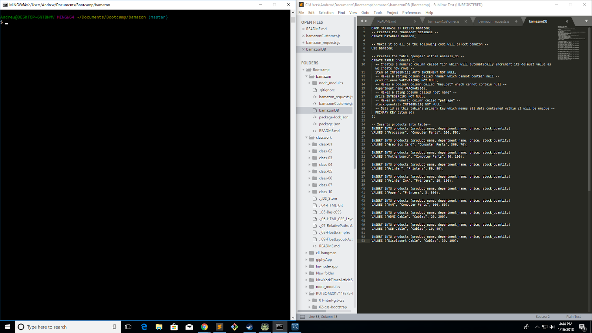
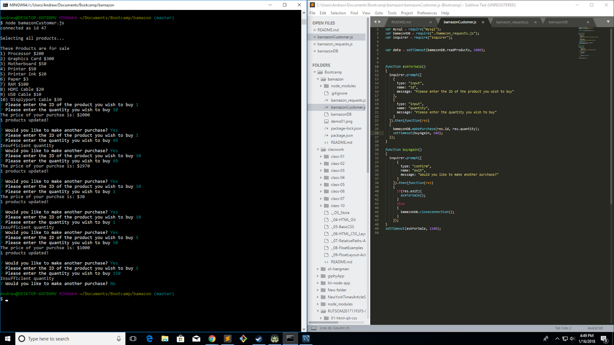

# bamazon

This project has a backend database created to simulate customer interactions. The database has 10 items with different prices and quantities. The customer is queried as to which product they wish to purchase and in what quantity. The backend is checked to ensure enough stock to fulfill the order and a price is passed back to the customer.

###Files

#####bamazonDB
This contains the code used to instantiate the database in mysql workbench. It creates a table with unique id, product name, the deparment it's in, the current price, and the current quantity. Next 10 items are added into populate the initial table.

#####bamazon_requests.js
This file is used to communicate with the backend using mysql npm package. First the program establishes the connection information and proceeds to set up the initial connection. It has four methods: readProducts, updateTable, makePurchase, and closeConnection. readProducts queries all records from the table and then lists the item_id, product_name, and price of each product for the user. updateTable takes an id and quantity and sets the item given by id to the new quantity. makePurchase contains the logic determining if a given purchase can be made before passing the information to updateTable or notifying the user of an impossible request. Lastly, closeConnection is used to close the connection to the database at the end of program use.

#####bamazonCustomer.js
This file is responsible for handling customer interaction with inquirer and passing requests along to the back end. It has two functions: askForSale and buyAgain. Initially, readProducts is called to display possible products to the user. askForSale requests the purchase id and quantity the customer wishes and calls makePurchase of bamazon_requests. It then calls the buyAgain function to determine if the user wishes to make another purchase or if the connection to the database can be closed.

	

	

The above images display the initial table creation and basic testing/functionality of the app. The app displays the 10 products available for customer purchase and asks the user to enter the ID then the quantity for purchase. Then the price is output and a query is sent to the customer to ask if they wish to purchase again. This is repeated a few times. The initial query demonstrates fucntionality and the following query shows the customer cannot exceed purchases. These iterations demonstrate the the program works correctly when purchasing products, attempting to purchaseing more products than exist, and when purchasing the last of the products. 
